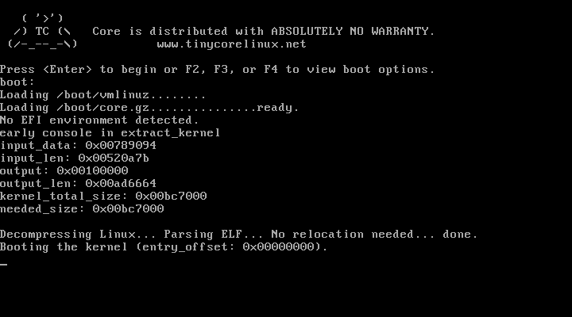
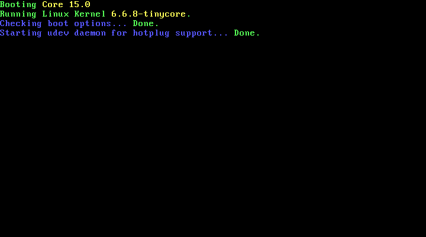
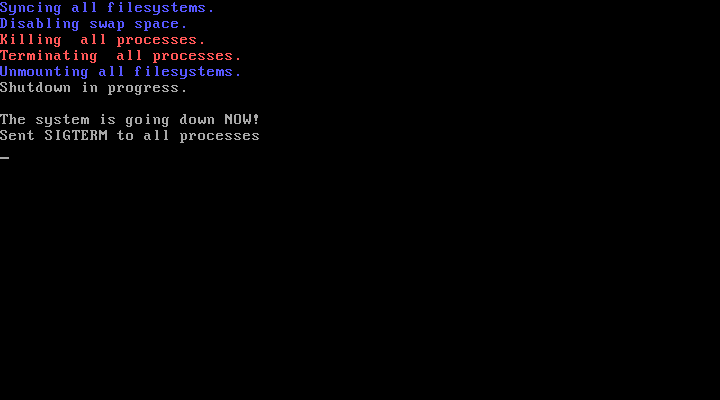

# Scripts to remaster Tiny Core Linux

Remastering [Tiny Core Linux][tinycore] allows us to create customized bootable 
Linux ISO images that provides a minimal live Linux environment for shipping 
and running software.

*Tiny Core Linux Remaster* is a set of shell scripts to automate 
[Tiny Core Linux][tinycore] remastering. They demonstrate several methods to
customize the base [Tiny Core Linux][tinycore] ISO image:

1. Building and loading extensions
2. Repacking _initrd_ `core.gz` image
3. Adding and loading additional custom _initrd_ `core.gz` image 

_Fig 1. Bootloader decompressing and loading kernel_

_Fig 2. Kernel booting and starting services_

_Fig 3. Shut down_

[tinycore]: http://www.tinycorelinux.net
